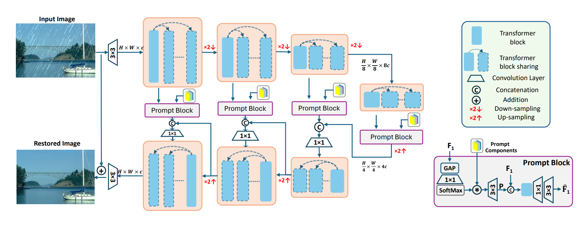
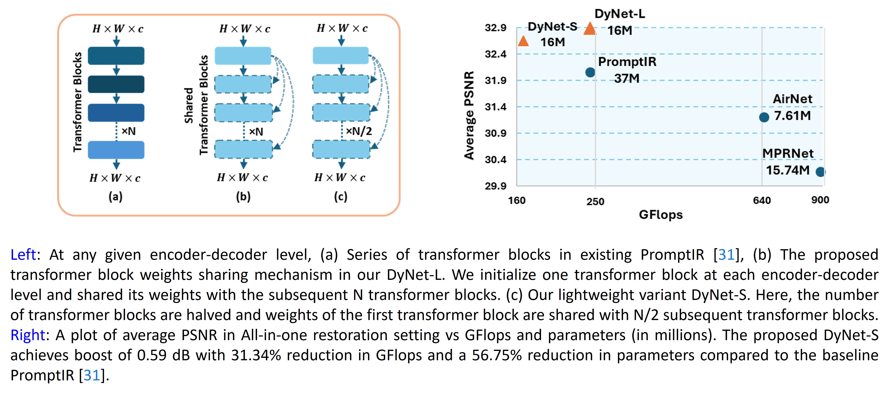
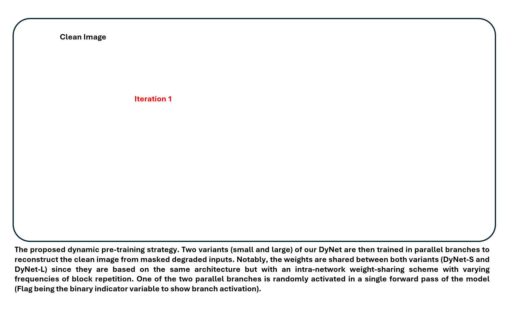
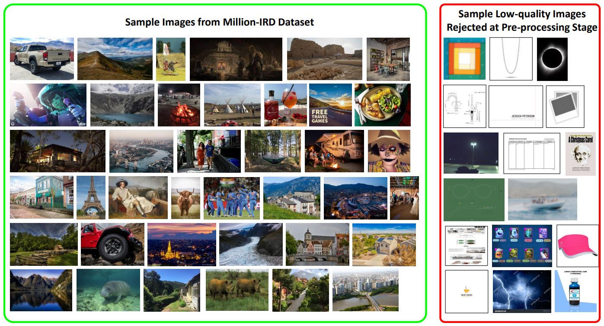
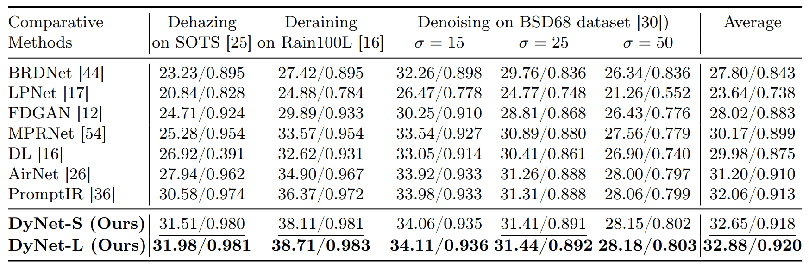

# DyNet
### **Dynamic Pre-training: Towards Efficient and Scalable All-in-One Image Restoration**

<p align="center">
    
</p>

#### [Akshay Dudhane](https://scholar.google.com/citations?user=BG_XEmkAAAAJ&hl=en), [Omkar Thawakar](https://github.com/OmkarThawakar/), [Sayed Waqas Zamir](https://github.com/swz30/), [Salman Khan](https://salman-h-khan.github.io/), [Ming-Hsuan Yang](https://scholar.google.com.pk/citations?user=p9-ohHsAAAAJ&hl=en) and [Fahad Khan](https://sites.google.com/view/fahadkhans/home)


#### **Mohamed bin Zayed University of AI, Inception Institute of AI, Australian National University, University of California - Merced, Yonsei University, Google Research, Linköping University**

[](https://arxiv.org/pdf/2404.02154.pdf)

## Latest 
- `2024/04/02`: We released our  on [arxiv](https://arxiv.org/pdf/2404.02154.pdf). Stay tuned for our Million-IRD dataset, code, and trained models.

<br>
<details>
  <summary>
  <font size="+1">Abstract</font>
  </summary>
All-in-one image restoration tackles different types of degradations with a unified model instead of having task-specific, non-generic models for each degradation. The requirement to tackle multiple degradations using the same model can lead to high-complexity designs with fixed configurations that lack the adaptability to more efficient alternatives. We propose DyNet, a dynamic family of networks designed in an encoder-decoder style for all-in-one image restoration tasks. Our DyNet can seamlessly switch between its bulkier and lightweight variants, thereby offering flexibility for efficient model deployment with a single round of training. This seamless switching is enabled by our weights-sharing mechanism, forming the core of our architecture and facilitating the reuse of initialized module weights. Further, to establish robust weights initialization, we introduce a dynamic pre-training strategy that trains variants of the proposed DyNet concurrently, thereby achieving a 50% reduction in GPU hours. To tackle the unavailability of a large-scale dataset required in pre-training, we curate a high-quality, high-resolution image dataset named Million-IRD, having 2M image samples. We validate our DyNet for image denoising, deraining, and dehazing in an all-in-one setting, achieving state-of-the-art results with 31.34% reduction in GFlops and a 56.75% reduction in parameters compared to baseline models
</details>

## Dynamic Network Architecture


## Proposed Weights-Sharing Strategy


## Sample Visualization of Dynamic Pre-training


## Samples from our Million-IRD Dataset


## Installation and Data Preparation

Refer [INSTALL.md](INSTALL.md) for instructions on installing dependencies and preparing the dataset necessary to use this codebase.

## Training

Once organized the training data in the ```data/``` directory, use 
```
python train.py
```
To begin training the model, utilize the ```de_type``` argument to select the combination of degradation types you wish to train on. By default, it is configured to include all three degradation types: noise, rain, and haze.

Example Usage: to train on deraining and dehazing:
```
python train.py --de_type derain dehaze
```

## Testing

After arranging the testing data within the ```test/``` directory, move the model checkpoint file to the ```ckpt``` directory. You can download the pretrained model from [here](https://mbzuaiac-my.sharepoint.com/:f:/g/personal/akshay_dudhane_mbzuai_ac_ae/EqoLj9MhONFPpis7SJgDAwQBxRRa8n0bfrojKb4LwfXY1w?e=0aXjrZ) or find it under the releases tab. To conduct the evaluation, use
```
python test.py --mode {n}
```
```n``` specifies the tasks to be evaluated: use 0 for denoising, 1 for deraining, 2 for dehazing, and 3 for an all-in-one setting.
Example Usage: To test all the degradation types at once, run the following:

```
python test.py --mode 3
```

## Results
Performance results of the PromptIR framework trained under the all-in-one setting

**Table**: Comparison results in the All-in-one restoration setting. Our DyNet-L model
outperforms PromptIR [36] by 0.82 dB on average across tasks. Additionally, our
DyNet-S model achieves a 0.59 dB average improvement over PromptIR [36], with
reductions of 31.34% in parameters and 56.75% in GFlops.
 

<summary><strong>Visual Results</strong></summary>


## Citation
if you use our work, please consider citing us:
```BibTeX
@misc{dudhane2024dynamic,
      title={Dynamic Pre-training: Towards Efficient and Scalable All-in-One Image Restoration}, 
      author={Akshay Dudhane and Omkar Thawakar and Syed Waqas Zamir and Salman Khan and Ming-Hsuan Yang and Fahad Shahbaz Khan},
      year={2024},
      eprint={2404.02154},
      archivePrefix={arXiv},
      primaryClass={cs.CV}
}

```

